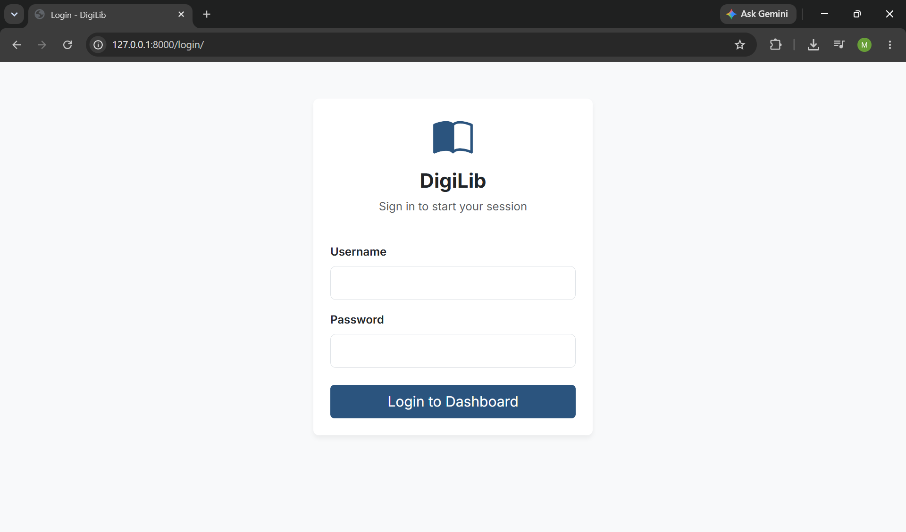
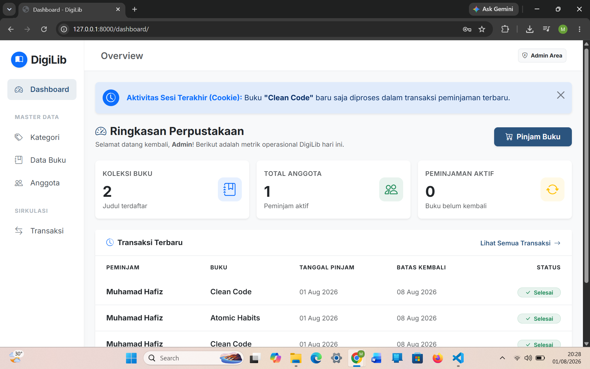
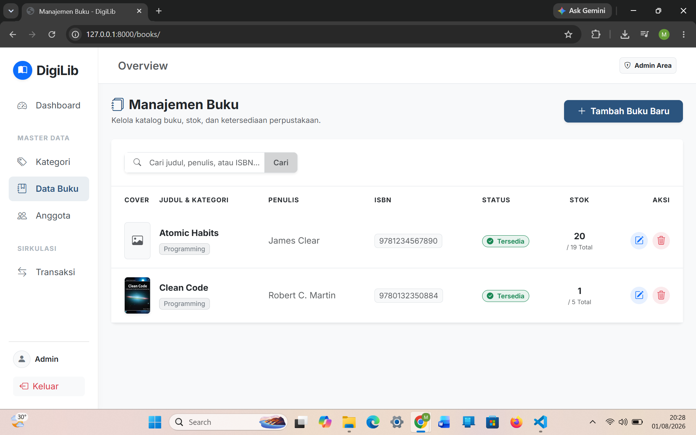
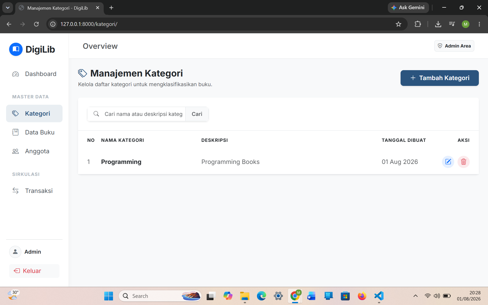
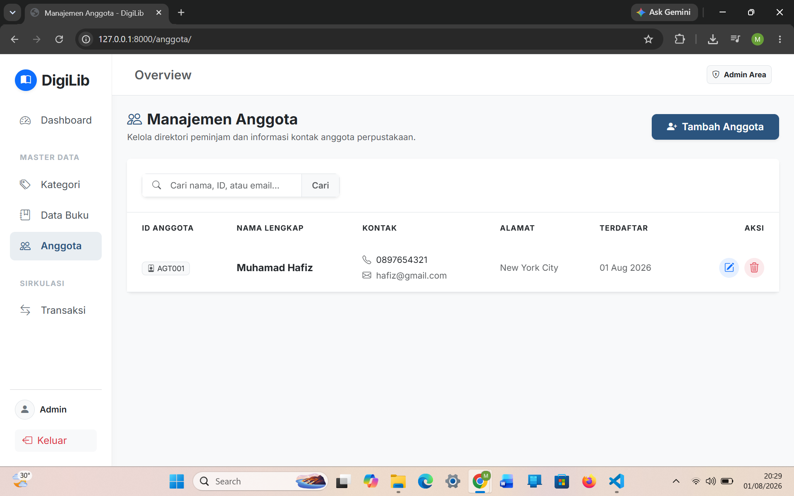
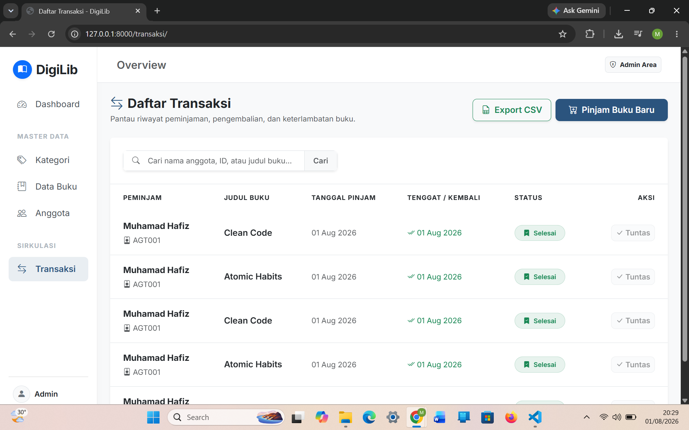

# 📚 Digital Library Management System


A modern web-based Library Management System built with **Django** and **Bootstrap 5**. This application helps librarians manage books, members, and borrowing transactions efficiently through a clean and responsive interface.

---

## ✨ Features

### 📊 Dashboard
- Real-time statistics
- Total books
- Total members
- Active borrowings
- Recently borrowed book (Cookie-based)

### 📚 Book Management
- Add books
- Edit books
- Delete books
- Book availability tracking
- Category assignment

### 👥 Member Management
- Register members
- Update member information
- Delete members
- Validation for borrowing history

### 🏷 Category Management
- Create categories
- Update categories
- Delete categories

### 🔄 Borrowing System
- Borrow books
- Automatic stock reduction
- Automatic due date (7 days)
- Transaction history

### ✅ Returning System
- Return borrowed books
- Automatic stock restoration
- Return date recording
- Transaction status update

### 📄 Reporting
- Export transaction history to CSV
- Excel-compatible CSV format (semicolon delimiter)

### 🔐 Authentication
- Django Authentication
- Login
- Logout
- Protected pages

---

# 🛠 Tech Stack

| Technology | Description |
|------------|-------------|
| Python 3.13 | Programming Language |
| Django 6 | Backend Framework |
| SQLite | Database |
| Bootstrap 5 | UI Framework |
| HTML5 | Markup |
| CSS3 | Styling |
| JavaScript | Client-side Interaction |
| Bootstrap Icons | Icons |
| Git & GitHub | Version Control |

---

# 📁 Project Structure

```text
Digital_Library_Management_System/
│
├── core/
├── library/
├── templates/
├── static/
│   └── css/
├── media/
├── docs/
├── assets/
├── manage.py
├── requirements.txt
└── README.md
```

---

# 📷 Screenshots

## Login Page


## Dashboard


## Book Management


## Category Management


## Member Management


## Transactions


---

# ⚙ Installation

Clone the repository

```bash
git clone https://github.com/Hafizzz14/digital-library-management-system.git
```

Move into the project directory

```bash
cd Digital_Library_Management_System
```

Create virtual environment

```bash
python -m venv venv
```

Activate virtual environment

Windows

```bash
venv\Scripts\activate
```

Install dependencies

```bash
pip install -r requirements.txt
```

Run migrations

```bash
python manage.py migrate
```

Create superuser

```bash
python manage.py createsuperuser
```

Start development server

```bash
python manage.py runserver
```

Open

```
http://127.0.0.1:8000/
```

---

# 📌 Business Workflow

```
Login
    │
    ▼
Dashboard
    │
    ├── Manage Categories
    ├── Manage Books
    ├── Manage Members
    │
    ▼
Borrow Book
    │
    ▼
Stock Reduced Automatically
    │
    ▼
Return Book
    │
    ▼
Stock Restored Automatically
    │
    ▼
Export CSV Report
```

---

# 🚀 Future Improvements

- PDF Export
- Search & Filter
- Pagination
- Email Notifications
- Barcode Scanner
- Book Cover Upload
- User Roles
- Dark Mode

---

# 👨‍💻 Author

**Muhamad Hafiz**

GitHub:
https://github.com/Hafizzz14

---

## ⭐ If you like this project, don't forget to give it a star!